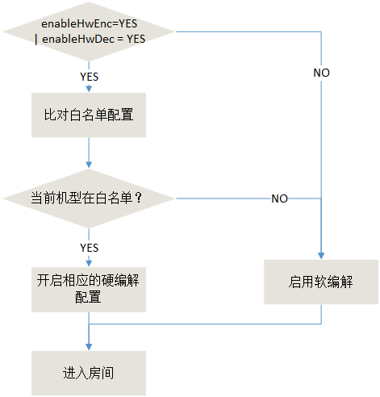

# 如何开启硬件编解码配置

## 适用对象
1. 想了解SDK软硬编解规则的用户； 
2. 想通过合理配置硬编解，提高App性能的用户。 

## 软硬编解区别

软编解：CPU消耗大，不会有硬件兼容性问题；
硬编解：CPU消耗小，但是如果出现硬件兼容性问题，极易出现花屏，黑屏等问题；尤其是Android机型众多，硬件芯片不一，如果开启硬编解不当，极易出现花屏黑屏等问题；

## QAVSDK硬件编解码现状

<table>
<tr><td width="10%">场景</td><td width="10%">编解码</td><td width="10%">平台</td><td width="70%">开启条件</td><tr>
<tr><td rowspan=4>实时通信<br>极速模式</td><td>编码</td><td>all</td><td>不开启</td></tr>
<tr><td rowspan=3>解码</td><td>Android</td><td>系统4.2及以上系统，且机型在白名单中</td></tr>
<tr><td>iOS</td><td>系统为8.0及以上系统</td></tr>
<tr><td>windows</td><td>不开启</td></tr>
<tr><td rowspan=6>互动直播</td><td rowspan=3>编码</td><td>Android</td><td>系统为4.4及以上系统；编码分辨率640*368及以上分辨率；分辨率为固定分辨率；且机型在白名单机型中</td></tr>
<tr><td>iOS</td><td>系统为IOS 8及以上系统；编码分辨率640*368及以上分辨率；分辨率为固定分辨率；小画面关闭</td></tr>
<tr><td>windows</td><td>不开启</td></tr>
<tr><td rowspan=3>解码</td><td>Android</td><td>系统为4.2及以上系统；机型在白名单中</td></tr>
<tr><td>iOS</td><td>iOS 8及以上系统</td></tr>
<tr><td>windows</td><td>不开启</td></tr>
</table>

备注：<font color=red>Android机型白名单，是内部测试通过，可以正常开放编解码的机型，不对外开放；</font>


## 如何开启硬件编解码配置
下面主要介绍在iOS以及Android上开启硬编解配置

### <a name="step1">方法1:配置开启</a>
SDK内部硬编解流程说明：



1. 进房参数的enableHwEnc和enableHwDec字段配置，详见文件`AVRoomMulti.EnterParam.Builder`如下参数说明，SDK默认配置为YES，<font color='red'>另注意该开关是1.9.1版本才支持，如果是之前的版本，直接参考<a href="#step2">第2步</a></font>；

```

 AVRoomMulti.EnterParam.Builder	isEnableHwDec(boolean _isEnableHwDec); //使用硬件解码，默认开。
 AVRoomMulti.EnterParam.Builder	isEnableHwEnc(boolean _isEnableHwEnc); //使用硬件编码，默认开。


```

2. 从流程图中可以看出，并不是将enableHwEnc和enableHwDec字段配置成YES之后，就会开启硬编解，其还要与机型白名单配合使用。此时，业务侧如果有需要开启的机型列表，需要提工单申请。腾讯云收到工单后，会为业务单独配置并理白名单，工单处理完后，即可按上述流程使用；

总结：

* 如果业务侧发现现网某机型有问题，可用上述参数，去主动关闭硬编解配置； 
* 机型列表，需要提工单添加要要开启码编解的机型列表（主要是android机型），由腾讯云为业务配置之后，再使用；
* 该参数主要是针对android, iOS的机型普通支持硬编解；


### <a name="step2">方法2:本地强制开启</a>
本地强制开启硬编解，需要在本地如下目录，添加<font color='red'>`aConfig.txt`</font>配置文件，重启后生效，<a href="aConfig.txt">下载配置文件示例</a>:

* Android ：SD卡根目录
* iOS ：app目录下Doucument目录

参考附件中<font color='red'>`aConfig.txt`</font>配置文件，其中

```
HwEnc=1 # 打开硬件编码
HwEnc=0 # 关闭硬件编码
HwDec=1 # 打开硬件解码
HwDec=0 # 关闭硬件解码
```
