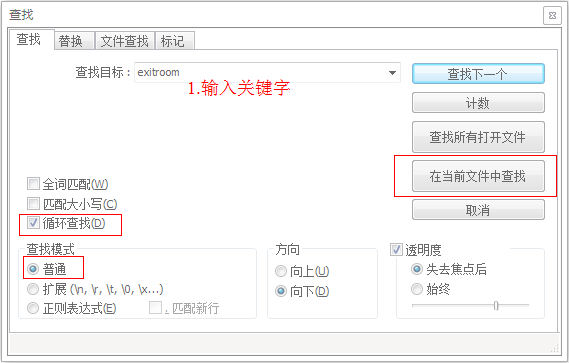

# AVSDK日志基本查询技巧
## 日志的介绍
* 日志的作用 ：主要记录了AVSDK调用接口的顺序。可通过日志，查用户调用AVSDK的API情况，分析使用过程出现的问题；
* 日志的位置 ：详细位置可查 [腾讯云>互动直播>日志](https://www.qcloud.com/document/product/268/7752)
* 日志的时间 ：<font color=red>日志的时间，是用户当前手机的时间，在实际使用过程中，如果查看日志者与实际用户不在同一时区，记得先问清楚用户的时间之后，再较准下出问题时时间段，以免遗漏问题</font>

## 日志分析工具 

1. windows上可用 Notepad++ 打开日志，Ctrl+F后，`查找目标`中输入关键字，点击`在当前文件中查找`，即可过滤出想要的信息，<font color=red>剩下的即是按下面的方法查阅过滤信息</font><br/>

2. Mac可直接双击日志（默认控制台打开），如果打不开，可传到Windows上用notepad打开查开，或使用其他工具或命令行(主要是grep命令)去分析均可；

以下主要介绍如何使用window notepad进行分析日志。

## <a name="log_spliteline">日志分隔符</a>

1. 作用：通过分隔符过过滤掉不重要的日志，缩小查找范围；
2. 关键字：************************************************************************************************************************************************
3. 关键日志：使用时，可根据用户反馈的`时间段`，定位出相应日志块，将日志块复制到单独文件进行分析；
2. 常见问题：<font color=red>如果同一时间段出现多次`关键字`，可询问客户的集成方式 ：是否每次直播的时候都进行了`login->startcontext->enterroom->exitroom->stopcontext->destorycontext->logout`操作，如果是，可引导用户使用正确的使用流程</font>

## <a name="log_startcontext">开启音视频上下文</a>
### <a name="log_getuserinfo">获取用户基本信息</a>
1. 作用：AVSDK正常使用的提前，如果没有开启上下文，后续都无法正常使用。在startcontext中会调云后台<a href="#log_getspearinfo">拉取spear配置</a>（主要用于后期直播时使用）
2. 关键字：startcontext
3. 关键日志： 可通过该字段分析用户的基本信息; 初始化之前用户是否有登录；
4. 常见问题：
   
*  用户基本信息：可查过滤后信息里面找到类似日志：`AVContext::Start():sdk_app_id=1400012909, account_type=6669, app_id_at3rd=1400012909, identifier=9106000, engine_ctrl_type=1`，从该日志中可获取用户的基本信息（sdkappid, identifier）,可使用[AVMonitor](http://avq.server.com/reportapp/)进行查看详细的信息；<br/>
	<font color=red>案例：之前有个用户反馈其更新版本后，新老版本间无法互通，但两个新版本或两个老版本之前正常。 后拿到有问题的日志后，查到两个版本下的`app_id_at3rd`值不一致导致</font>
	
*  用户是否有登录：<font color=red>如果用户没有登录，在过滤后的信息中，会搜到`imsdk not init`或`start context failed`，可询问用户是否有登录。如果用户登录，询问用户是否在`other linker flag`处理添加`-ObjC`。</font><br/>
					<font color=red>案例：在184版本中，有个用户反馈其一直报开启上下文超时(1005)，当时查到的用户的`identifier`是中文，而该版本中的拉取spear信息的url没作URLEncode，导致url中出现中文，无法访问。反馈给SDK后修复</font>
					
*  如果过滤后的日志中发现startcontext次数较多：可询问客户的集成方式 ：是否每次直播的时候都进行了`login->startcontext->enterroom->exitroom->stopcontext->destorycontext->logout`操作，<font color=red>此处一定要引导用户：<br/>1.如果每次startcontext，会影响进房的体验，而且当业务侧使用人数较多时，会造成后台服务器响应超时，原因在startcontext中使用http请求拉取spear配置，当使用人数多时，服务端会出现http响应超时，从而导致客户端startcontext不成功，影响整本使用； <br/>2. startcontext拉取到的配置是基本上是不会有变动的，可以不用重复拉取;</font>


### <a name="log_getspearinfo">拉取spear配置</a>
1. 作用：去后台取spear配置，拉取到的信息可用于排查<a href="#log_enterroom">进房间</a>时的一些问题；
2. 关键字：https
3. 关键日志：过滤后会找到类似如`https://confvoice.qcloud.com/index.php?sdk_appid=1400012909&sdk_version=115&interface=Voice_Conf_Download&identifier=9106000&last_update_sequence=162&platform=1`的过滤信息，将其放入到流览器即可查看具体的spear配置，通过分析响应数据，判断进房间的时候的配置是否正确。
4. 注意事项：如果在将搜索到的链接放入济览器中，返回类似以下的信息（没有看到具体的spear配置），这是因为有<font color=red>**省流机制**（SDK首次请求完spear信息成功后，会在本地缓存，并存储云后台最后一次更新序列号last_update_sequence，下次请求时带上本地存储的last_update_sequence与后台进行比对，后台发现序列号一致时，说明spear没有更新，则不返回spear配置，客户端则使用本地存储的spear配置）</font>
```
{"data":{"biz_id":1400012909,"conf":[],"platform":1,"sequence":162},"errmsg":"success.","retcode":0}
```
<font color=red>此时只需要将上述地址中的`&last_update_sequence=162`去掉即可拉取所的配置</font>

<!--5. 补充如何查看spear信息-->


## <a name="log_enterroom">进房流程查询</a>

### <a name="log_enterroom_param">1.进房间配置参数检查</a>
1. 作用：可以查看用户进房间的配置参数，主要是房间号，权限，角色，用于检查用户的初步配置
2. 关键字：enterroom
3. 关键日志：`******EnterRoom. room_multi_delegate = 0x17487a840, relation id = 房间号, auth_bits = 权限, 	auth_buffer_len = 0, audio_category = 音频模式, enable_hd_audio = 高品质, control_role = 角色, 	create_room = 是否自动创建房间, video_recv_mode = 摄像头半自动接收,screen_recv_mode = 屏幕分享半自动接收, auto_rotate_video = 转置`<br/>

	* 	房间号：1.如果没填（值为0）或填负值，是进房间会报错；2.报用户进不了房间时，需要对比相同时间段内加入的房间号是否相同
	* 	权限：可按下面的值组合出具体的能力，结合用户的反馈判断其参数是否合理；

	```
	#define QAV_AUTH_BITS_DEFAULT 0xFFFFFFFFFFFFFFFF ///< 缺省值。拥有所有权限。
	#define QAV_AUTH_BITS_OPEN 0x000000FF            ///< 权限全开
	#define QAV_AUTH_BITS_CLOSE 0x00000000           ///< 权限全关
	#define QAV_AUTH_BITS_CREATE_ROOM 0x00000001     ///< 创建房间权限。
	#define QAV_AUTH_BITS_JOIN_ROOM 0x00000002       ///< 加入房间的权限。
	#define QAV_AUTH_BITS_SEND_AUDIO 0x00000004      ///< 发送语音的权限。
	#define QAV_AUTH_BITS_RECV_AUDIO 0x00000008      ///< 接收语音的权限。
	#define QAV_AUTH_BITS_SEND_VIDEO 0x00000010      ///< 发送视频的权限。
	#define QAV_AUTH_BITS_RECV_VIDEO 0x00000020      ///< 接收视频的权限。
	#define QAV_AUTH_BITS_SEND_SUB 0x00000040        ///< 发送辅路视频的权限。
	#define QAV_AUTH_BITS_RECV_SUB 0x00000080        ///< 接收辅路视频的权限。
	```
	* 角色：可根据<a href="#log_getspearinfo">拉取spear配置</a>中的结果查看是否是有效的角色；185之后，后台spear有更新，如果没有对应角色，又没有默认角色(<a href="#log_getspearinfo">拉取spear配置</a>中搜索`is_default`字段)时，使用SDK自带的默认配置，开始直播后经常会出现一些奇怪的现象；另外如果用户反馈码率等信息不服合预期，此处也是可分析点；


### <a name="log_enterroom_ipaddress">2.拉取接口机列表</a>
1. 作用：排查进房间时连接口机情况，主要可查是进房时间过长，或者进房超时问题
2. 关键字：room_server_info
3. 关键日志：云后台返回以下IP列表地址后，SDK会根据返回的日去连接接口，先作UDP去连（8000端口），如果连不上则会使用TCP去连（443端口），每次会等10s，任何一个连接上，则进房成功。如果全连接不上，则报超时；

```
2017/07/11 17:08:58.281| E| 28858| AVGSDK | av_room_multi_info_impl.cpp(126):SetServerInfoList| room_server_info. i = 0, ip = 123.151.76.225, port = 8000, isTcp = 0
2017/07/11 17:08:58.281| E| 28858| AVGSDK | av_room_multi_info_impl.cpp(126):SetServerInfoList| room_server_info. i = 1, ip = 123.151.76.225, port = 443, isTcp = 1
2017/07/11 17:08:58.281| E| 28858| AVGSDK | av_room_multi_info_impl.cpp(126):SetServerInfoList| room_server_info. i = 2, ip = 123.151.76.250, port = 8000, isTcp = 0
2017/07/11 17:08:58.282| E| 28858| AVGSDK | av_room_multi_info_impl.cpp(126):SetServerInfoList| room_server_info. i = 3, ip = 123.151.76.250, port = 443, isTcp = 1
2017/07/11 17:08:58.282| E| 28858| AVGSDK | av_room_multi_info_impl.cpp(126):SetServerInfoList| room_server_info. i = 4, ip = 123.151.76.246, port = 8000, isTcp = 0
2017/07/11 17:08:58.282| E| 28858| AVGSDK | av_room_multi_info_impl.cpp(126):SetServerInfoList| room_server_info. i = 5, ip = 123.151.76.246, port = 443, isTcp = 1
2017/07/11 17:08:58.282| E| 28858| AVGSDK | av_room_multi_info_impl.cpp(126):SetServerInfoList| room_server_info. i = 6, ip = 123.151.76.172, port = 8000, isTcp = 0
2017/07/11 17:08:58.282| E| 28858| AVGSDK | av_room_multi_info_impl.cpp(126):SetServerInfoList| room_server_info. i = 7, ip = 123.151.76.172, port = 443, isTcp = 1
```
一般情况下都是UDP连接，是否连接成功，可搜索关键字`connect`，在过滤后的信息中查找类似以下的内容

```
2017/07/11 17:08:58.315| E| 18637| multi_r| multi_room_network_impl.cpp(221):AsynConnect      | *******************UDP Channel Connect Start 123.151.76.225:8000
2017/07/11 17:08:58.315| E| 18637| multi_r| multi_room_network_impl.cpp(440):SetCsState       | Channel State Changed - OldState = 0, NewState = 1
2017/07/11 17:08:58.315| E| 18637| CAVGRoo| AVGRoomLogic.cpp(221):CsSink_OnCsStateChanged     | CAVGRoomLogic::CsSink_OnCsStateChanged - OldState = 0, NewState = 1
2017/07/11 17:08:58.318| D| 18637| multi_r| multi_room_network_impl.cpp(454):OnConnect        | Work Thread : CAVGCsProcessor::OnConnect(bSuccess=1)
2017/07/11 17:08:58.318| E| 18637| multi_r| multi_room_network_impl.cpp(479):OnConnect        | *******************Channel connected successfully.*******************
```

4. 常见问题：

* 	对于一些受限网，或者禁端口的网络，进房一般不会成功，或者进房要等10s以上，可根据这一现象，排查进房进是否有连接上接口机;
*  如果用户反馈的是一直进不了房间，可询问用户是否使用的是ipv6环境（海外运营商环境居多），可让用户访问[ipv6测试地址](http://test-ipv6.com/index.html.zh_CN)，然后拿到截图信息，即可判断用户环境了。如之前猎豹反馈美国用用户在运营商网络下，进房不成功，后SDK排查是底层xplatform判断网络协议栈逻辑有误导致，如有同类型问题，可引导用户更新1.9.1.17之后的版本;
*  出现问后，可查到该IP地址，ping下，看网络是否通；

### <a name="log_enterroom_failcode">3.进房失败常见的错误码</a>
1. 进房成功的话一般会类似以下的日志，关键字可搜`EnterRoom OK`

```
2017/07/11 17:08:58.347| I| 28858| Client | av_context_impl.cpp(1137):OnEnterRoomCompleteInter| ******EnterRoom OK. ret_code = 0, roomState_ = 2. Self tiny id = 144115199910112073
```

2. 进房失败的话，一般会有类似以下的日志，关键字可搜`EnterRoom failed`，<font color=red>此时详细关注`ret_code`的值，如果是10000以上的错误码，可找用户要到`-(void)OnEnterRoomComplete:(int)result WithErrinfo:(NSString *)error_info`中反馈的`error_info`，然后具体可看<a href="10000以上被转换的错误码.xls">该文档</a>, 如果是10000以内的错误码（常见的是1002, 1003），可查看[AVSDK客户端错误](https://www.qcloud.com/document/product/268/8423)，</font>
```
2017/07/13 15:15:47.744| I| 28789| Client | av_context_impl.cpp(1139):OnEnterRoomCompleteInter| ******ERROR. EnterRoom failed. ret_code = 10005, roomState_ = 0. Self tiny id = 144115200359467436
```


### <a name="log_enterroom_imfailcode">4.ILiveSDK进房与群相关</a>
ILiveSDK里面的有下面两个接口可以进入直播间，二者区别在于，默认进房配置里面：<br/>

* `createRoom`会先创建IM群，再进入音视频房间; 
* `joinRoom`则是加入IM群，再进入音视频房间;

```
/**
 创建直播间（主播端调用）

 @param roomId 直播间ID
 @param option 房间配置
 @param succ   创建直播间成功回调
 @param fail   创建直播间失败回调
 */
- (void)createRoom:(int)roomId option:(ILiveRoomOption *)option succ:(TCIVoidBlock)succ failed:(TCIErrorBlock)fail;

/**
 加入直播间（观众端调用）

 @param roomId 直播间ID
 @param option 房间配置
 @param succ   加入直播间成功回调
 @param fail   加入直播间失败回调
 */
- (void)joinRoom:(int)roomId option:(ILiveRoomOption *)option succ:(TCIVoidBlock)succ failed:(TCIErrorBlock)fail;
```
与此处相关的IM错误码有：
<table>
<tr>
<td width=10%></td><td width=10%>错误码</td><td width=35%>说明</td><td width=35%>解决办法</td>
</tr>

<tr>
<td>createRoom</td><td> 10021 </td><td>群组ID已被使用，请选择其他的群组ID。</td><td>业务分分配置的房间号已被其他人创建，不能再创建</td>
</tr>
<tr>
<td rowspan=2>joinRoom</td><td> 10010 </td><td>群组不存在，或者曾经存在过，但是目前已经被解散。</td><td>业务分分配置的房间号已被其他人创建，不能再创建</td>
</tr>
<tr>
<td> 10013 </td><td>被邀请加入的用户已经是群成员。</td><td>已经是群成员，可忽略该错误码，直接往下走</td>
</tr>

</table>

其他与群相关的错误码，可查看[IMSDK错误码此处](https://www.qcloud.com/document/product/269/1671)

## <a name="log_exitroom">退房流程</a>


### <a name="log_exitroom_normal">正常退房流程</a>

1. 作用：如果退房不成功，极易造成下次进房间时出错。正常情况下，退房与进房成对出现，如果没有成对出现可询问用户的具体操作是怎么样的。
2. 关键字：ExitRoom
3. 关键日志：`******ExitRoom OK. ret_code = 0, roomState_ = 0.`
4. 注意事项：
	* 从1.8.2.69开始，退房接口已改成本地退出，不再与云后台有通信，所以一般情况下（除<a href="#log_disconnectroom">SDK底层异常退出</a>外），调用退房都是会成功的，即上述日志中的`ret_code`为0, 若不为0, 可查看[AVSDK客户端错误](https://www.qcloud.com/document/product/268/8423)中详细说明；
	* 如果当前直播的时候，收到IM的互踢通知，记得先退出当前的房间，然后再作im的logout以及<a href="#log_stopcontext">停止音视频上下文</a>（不会主动退出当前的房间），否则换帐号登录时，再次使用时会有问题；
	* 之前直接集成AVSDK的一些用户有，因为退房的时候，业务层代码问题，导致界面没有及时释放，经常会导致下一次使用时，还法正常的渲染（会出现闪屏或crash）：像这样的用户先问清楚其是用哪种方式集成的，如果是直接集成AVSDK，可询问其业务逻辑直播界面是否有及时释放；

### <a name="log_disconnectroom">异常退房流程</a>
1. 作用：检查是否出现SDK因心跳超时，SDK自动退出音视频房间
2. 关键字：
3. 


## <a name="log_avdata">数据流情况</a>

## <a name="log_eventid">用户事件</a>

## <a name="log_stopcontext">停止音视频上下文</a>

