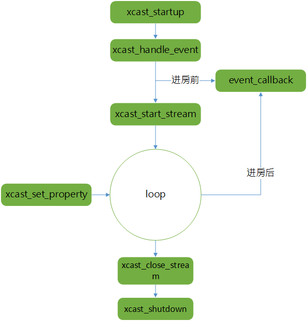

# XCast对接流程


##  <a name="xcast_beforestart">准备工作（optional）</a>
### <a name="xcast_account">帐号接入</a>
1. IMSDK试接入 : IMSDK做登录，登录成功后使用对应帐号的tinyid作帐号传入xcast;
2. 非IMSDK方式接入 : 业务层将自有自符串帐号映身成数据帐号，然后传入xcast;  <font color="red">并做好鉴权逻辑（缺失如何鉴权 （authbuf））</font>

### <a name="xcast_spear">spear配置</a>
1. 静态配置：流览器拼spear url , 获取到spear的json串，以{$sdkappid}.conf方式存储到<font color="red">指定目录（各平台对应目录未确认）</font>;
2. 动态更新配置：业务层根据现有spear缓存逻辑进行请求并缓存到 以{$sdkappid}.conf方式存储到<font color="red">指定目录（各平台对应目录未确认）</font>;


## <a name="xcast_flow">xcast运行流程</a>



## <a name="xcast_data_t"> xcast\_data\_t基础参数类介绍</a>

* xcast API基本上都是使用key（命令字）- value（命令参数）方式控制底层逻辑，具体key-value协议可查询 `xcast_define.h`（可理解成协议文件），xcast内部参数说明也在该文件中；
* 在`xcast_define.h`中我们可以看出，基本上所有的value（命令参数）均是用类似json格式描述，接口对应的类型为`xcast_variant_t` （C接口），实际使用的是其封装 `xcast_data_t`（C++接口，xcast_data_t 重载*操作符实现转换逻辑，对于开发者实际使用时只需要知道 `xcast_data_t`即可）；
* `xcast_variant_t` 转换成 `xcast_data_t`

```
// xcast_variant_t 转  xcast_data_t
xcast_variant_t *e;
xcast_data_t            evt(e);

//  xcast_data_t 字符串类内查看
xcast_data_t data;
...
char *datastr =  data.dump();
printf("%s\n", datastr);


```

## <a name="xcast_integrate_flow">xcast接入流程</a>

### <a name="xcast_startup">xcast\_startup</a> (等同于AVSDK StartContext)
xcast_startup接口声明如下：

```
/*
* start xcast before xcast streaming.
* 
*  settings example : ["identifier":uint64(67890),"test_env":false,"app_id":int32(1400046799)] 
* `identifier` : 帐号，<a href="#xcast_account">帐号接入</a>中获取得的内容；
* `test_env` :  是否是测试环境  
* `app_id` : 即对应的SDKAPPID；
* 
* return ： 0 : 成功， 其他为失败；
*/
xcast_export int32_t xcast_startup(xcast_variant_t *settings);

```


示例代码：

```
xcast_data_t settings;
settings["app_id"] = 1400046799;
settings["identifier"] = 67890;
settings["test_env"] = false;

rt = xcast_startup(settings);
if (rt == XCAST_OK)
{  
	// startup成功
	_is_startup_succ = true;
}
else 
{
	// startup失败
   _is_startup_succ = false;
}

```

注意事项：<font color="red"> 业务层记录下是否有 xcast_startup  成功过 </font>， 如示例代码中的`_is_startup_succ`;


###  <a name="xcast_handle_event">xcast\_handle_event </a> (注册事件监听)

接口说明如下：

```
/*
* register/unregister event callback into xcast to receive event notify.
* if the 'handler' is null, the callback is unregistered from xcast.
* 参数说明：
* event_path ： 在`xcast_define.h`中，其以 `XC_EVENT_`开头，如 XC_EVENT_SYSTEM，不能为空
* handler : 回调函数，如果取消对应event_path的事件监听，可以传NULL。不为NULL时，监听 event_path， 为NULL时，取消监听
* user_data : 上下文信息，会在 handler中作参数返回
* 返回值：0 成功，非0 , 失败
*/

xcast_export int32_t xcast_handle_event(
  const char *event_path, xcast_func_pt handler, void *user_data);
```

注意事项：<font color="red"> user_data为上下文信息，下同 </font>;


#### <a name="xcast_handle_event_protocol">事件监听回调格式说明</a>

```
/* xcast事件列表 */
/*
* xcast events notify path defines.
* register callbacks through 'xcast_handle_event()' can receive
* notifies from xcast, the notified event value is a 'xcast_variant_t' of 'vdict' type.
* // xcast支持的事件描述, ver 000.000.1
* // 注意：xcast的事件回调使用xcast_variant_t(vdict)类型的参数值。
* // 事件描述遵循以下格式(带"*"项表示必需项)：
* //   "事件路径":{
* //     // 事件源
* //     "*src":"vstring",
* //     // 事件类型
* //     "*type":"vstring",
* //     // 事件状态
* //     "state":"vstring",
* //     // 错误代码
* //     "err":"vint32",
* //     // 错误信息
* //     "err-msg":"vstring",
* //     // 事件自定义数据
* //     ...
* //   }
* //
* // 其中，"[]"表示数值可选，"{}"表示数值为字典vdict类型。
* //
*/
```

#### <a name="xcast_handle_event_detail">设置监听事件</a>
<font color="red">可以监听有事件说明在`xcast_define.h`中，其以 `XC_EVENT_` 开头</font>，即以下几种类型：

```

/*
* xcast支持的系统事件
* "event.system":{
*   // 事件源:
*   "*src":["system"],
*   // 事件类型: 警告，错误，致命
*   "*type":[xc_system_event_t],
*   // 事件状态
*   "state":["running","closed"],
*   // 错误代码
*   "err":"vint32",
*   // 错误信息
*   "err-msg":"vstring"
* },
*/
#define XC_EVENT_SYSTEM                     "event.system"  

/*
* xcast支持的媒体流事件
* "event.stream":{
*   // 事件源:媒体流名称
*   "*src":"vstring",
*   // 事件类型: 新增，更新，删除
*   "*type":[xc_stream_event],
*   // 事件状态
*   "state":[xc_stream_state],
*   // 错误代码
*   "err":"vint32",
*   // 错误信息
*   "err-msg":"vstring"
* },
*/
#define XC_EVENT_STREAM                     "event.stream"  

/*
* xcast支持的媒体流轨道事件
* "event.track":{
*   // 事件源: 轨道名 媒体流名称
*   "*src":"vstring",
*   "*stream":"vstring",
*   // 事件类型: 新增，更新，删除,媒体数据
*   "*type":[xc_track_event],
*   // 轨道类别: xc_track_audio,xc_track_video
*   "*class":[xc_track_type],
*   // 轨道方向: 上行,下行
*   "*direction":[xc_track_direction],
*   // 用户uin
*   "*uin":"vuint64",
*   // 轨道编号
*   "*index":"vuint32",
*   // 轨道状态
*   "state":[xc_track_state],
*   // 错误代码
*   "err":"vint32",
*   // 错误信息
*   "err-msg":"vstring",
*   // 轨道数据格式
*   "format":[xc_media_format],
*   // 轨道数据缓存
*   "data":"vbytes",
*   // 轨道数据缓存长度
*   "size":"vuint32",
*   // 轨道数据宽度
*   "width":"vuint32",
*   // 轨道数据高度
*   "height":"vuint32",
*   // 轨道数据旋转
*   "rotate":[0,90,180,270]
*   // 轨道数据视频源:摄像头，屏幕分享，媒体文件，PPT，未知源
*   "media-src":[xc_media_source]
* },
*/
#define XC_EVENT_TRACK                      "event.track"

/*
* xcast支持的设备事件
* "event.device":{
*   // 事件源: 设备名
*   "*src":"vstring",
*   // 事件类型: 新增，更新，删除,预处理数据,预览数据
*   "*type":[xc_device_added,xc_device_updated,
      xc_device_removed,xc_device_preprocess,xc_device_preview],
*   // 设备类型: xc_device_type
*   "*class":[xc_device_camera,xc_device_screen_capture,xc_device_player
*     xc_device_mic,xc_device_speaker,xc_device_external],
*   // 事件状态: 运行，停止
*   "state":[xc_device_running,xc_device_stopped],
*   // 错误代码
*   "err":"vint32",
*   // 错误信息
*   "err-msg":"vstring",
*   // 数据格式
*   "format":[xc_media_argb32,xc_media_i420,xc_media_aac],
*   // 数据缓存
*   "data":"vbytes",
*   // 数据缓存长度
*   "size":"vuint32",
*   // 数据宽度
*   "width":"vint32",
*   // 数据高度
*   "height":"vint32",
*   // 数据旋转
*   "rotate":[0,90,180,270],
*   // 音频设备：音量值，取值范围[0,100]
*   "volume":"vuint32",
*   // 音频设备：动态音量值，取值范围[0,100]
*   "dynamic-volume":"vuint32",
*   // 播放器路径
*   "player-path":"vstring",
*   // 音频文件路径
*   "file-path":"vstring",
*   // 播放进度
*   "current-pos":"vint64",
*   // 最大进度
*   "max-pos":"vint64",
*   // 伴奏源: 默认值,系统伴奏,应用伴奏(播放器进程)
*   "accompany-source":["none","system","process"],
*   // 左边界
*   "screen-left":"vint32",
*   // 上边界
*   "screen-top":"vint32",
*   // 右边界
*   "screen-right":"vint32",
*   // 下边界
*   "screen-bottom":"vint32",
*   // 捕获帧率
*   "screen-fps":"vuint32",
*   // 窗口句柄, 仅支持win
*   "screen-hwnd":"vint32"
* },
*/
#define XC_EVENT_DEVICE                     "event.device"

/*
* // <TODO>音频参数：获取通话中实时音频/视频质量相关信息
* "event.tips":{
*   // 事件源: "audio","video"
*   "*src":["audio","video"],
*   "*tips":"vstring"
* }
*/
#define XC_EVENT_STATISTIC_TIPS             "event.tips"

```


#### <a name="xcast_handle_event_regist">注册监听事件</a>
示例代码：

```
// 1. 声明处理回调函数；
static int32_t on_xcast_event(void *user_data, xcast_variant_t *e);
static int32_t on_stream_event(void *user_data, xcast_variant_t *e);
static int32_t on_track_event(void *user_data, xcast_variant_t *e);
static int32_t on_device_event(void *user_data, xcast_variant_t *e);
static int32_t on_stat_tips(void *user_data, xcast_variant_t *e);


// 2. 注册回调 
rt = xcast_startup(settings);
if (rt == XCAST_OK)
{  
	// startup成功
	
	/* 注册事件通知回调 */
	// user_data 可以为当前上下文信息，具体情况以业务为准，可为NULL
	xcast_handle_event(XC_EVENT_SYSTEM, (xcast_func_pt)on_xcast_event, user_data);
	xcast_handle_event(XC_EVENT_STREAM, (xcast_func_pt)on_stream_event, user_data);
   xcast_handle_event(XC_EVENT_TRACK, (xcast_func_pt)on_track_event, user_data);
   xcast_handle_event(XC_EVENT_DEVICE, (xcast_func_pt)on_device_event, user_data);
   xcast_handle_event(XC_EVENT_STATISTIC_TIPS, (xcast_func_pt)on_stat_tips, user_data);
	
	_is_startup_succ = true;
}
else 
{
	// startup失败
   _is_startup_succ = false;
}

```

#### 监听回调处理

处理回调前，可用该方法打信回调信息打印出来，然后对着协议进行解析

```

void xc_print_variant(xcast_data_t evt)
{
   
		const char             *err_msg;
  		int32_t                 err;
  		
	  
	  
	  	// 找印回调信息
	 	 char *evt_str = evt.dump();
	 	 if (evt_str)
	 	 	printf("%s\n", evt_str);
 	 
}
```

##### <a name="xcast_handle_event_systemeventcallback">系统事件回调处理</a>

回调格式说明

```
// 系统事件回调内容格式
* xcast支持的系统事件
* "event.system":{
*   // 事件源:
*   "*src":["system"],
*   // 事件类型: 警告，错误，致命
*   "*type":[xc_system_event_t],
*   // 事件状态
*   "state":["running","closed"],
*   // 错误代码
*   "err":"vint32",
*   // 错误信息
*   "err-msg":"vstring"
* },
*/
#define XC_EVENT_SYSTEM                     "event.system" 


/* xcast system events */
typedef enum xc_system_event_s {
  xc_system_normal = 1,
  xc_system_warning,
  xc_system_error,
  xc_system_fatal,
} xc_system_event_t;

```

示例代码：

```
/* xcast系统事件通知 */
static int32_t 
on_xcast_event(void *user_data, xcast_variant_t *e)
{
  const char             *err_msg;
  int32_t                 err;
  xcast_data_t            evt(e);
  
  
  // 找印回调信息
 xc_print_variant(evt);

  err = evt.get_int32("err");
  err_msg = evt.get_str("err-msg");
 
 // TODO: 将错误信息转给业务上层进一步处理

  return XCAST_OK;
}

```

#####  <a name="xcast_handle_event_streameventcallback">流事件回调处理</a>


```
/*
* xcast支持的媒体流事件
* "event.stream":{
*   // 事件源:媒体流名称
*   "*src":"vstring",
*   // 事件类型: 新增，更新，删除
*   "*type":[xc_stream_event],
*   // 事件状态
*   "state":[xc_stream_state],
*   // 错误代码
*   "err":"vint32",
*   // 错误信息
*   "err-msg":"vstring"
* },
*/
#define XC_EVENT_STREAM                     "event.stream"

// 流事件类型: 新增，更新，删除
/* xcast stream events */
typedef enum xc_stream_event_e {
  xc_stream_added = 1,                /* new stream added */
  xc_stream_updated,                  /* stream state updated */
  xc_stream_removed,                  /* stream removed */
} xc_stream_event;

// 流事件状态
/* xcast stream events */
typedef enum xc_stream_state_e {
  xc_stream_connecting = 1,           /* stream connecting */
  xc_stream_connected,                /* stream connected */
  xc_stream_closed,                   /* stream connected */
} xc_stream_state;


```
示例代码：

```
/* 流状态通知： 更新UI中媒体流状态 */
static int32_t
on_stream_event(void *user_data, xcast_variant_t *e)
{
  xcast_data_t            evt(e);
  xc_print_variant(evt);
  
  // 根据流事件类型处理
  switch ((int32_t)evt["type"]) {
  case xc_stream_added:
 {
   	 /* 新增媒体流, 初始化流状态： 连接中 */
   	 TODO：
    // ui_stream_connecting(evt["src"], user_data);
  }
    break;
  case xc_stream_updated:
    if (evt["state"] == xc_stream_connected) 
    {
      /* 流状态： 连接成功 */
      TODO： 流更新成功
      // ui_stream_connected(evt["src"], user_data);
    }

    break;
  case xc_stream_removed:
    /* 流状态： 关闭, 移除媒体流 */
    // TODO：通知上层流关闭了
    // ui_stream_closed(evt["src"], evt["err"], evt["err-msg"], user_data);
    break;
  default:
    break;
  }

```

##### <a name="xcast_handle_event_trackeventcallback">流轨道事件回调处理</a>

```
/*
* xcast支持的媒体流轨道事件
* "event.track":{
*   // 事件源: 轨道名 媒体流名称
*   "*src":"vstring",
*   "*stream":"vstring",
*   // 事件类型: 新增，更新，删除,媒体数据
*   "*type":[xc_track_event],
*   // 轨道类别: xc_track_audio,xc_track_video
*   "*class":[xc_track_type],
*   // 轨道方向: 上行,下行
*   "*direction":[xc_track_direction],
*   // 用户uin
*   "*uin":"vuint64",
*   // 轨道编号
*   "*index":"vuint32",
*   // 轨道状态
*   "state":[xc_track_state],
*   // 错误代码
*   "err":"vint32",
*   // 错误信息
*   "err-msg":"vstring",
*   // 轨道数据格式
*   "format":[xc_media_format],
*   // 轨道数据缓存
*   "data":"vbytes",
*   // 轨道数据缓存长度
*   "size":"vuint32",
*   // 轨道数据宽度
*   "width":"vuint32",
*   // 轨道数据高度
*   "height":"vuint32",
*   // 轨道数据旋转
*   "rotate":[0,90,180,270]
*   // 轨道数据视频源:摄像头，屏幕分享，媒体文件，PPT，未知源
*   "media-src":[xc_media_source]
* },
*/
#define XC_EVENT_TRACK                      "event.track"

// 协议中用到的枚举类型说明
/* xcast stream track events */
typedef enum xc_track_event_e {
  xc_track_added = 1,                 /* new track added */
  xc_track_updated,                   /* track state updated */
  xc_track_removed,                   /* track removed */
  xc_track_capture_changed,           /* track capture changed */
  xc_track_media,                     /* track media data coming */
} xc_track_event;

/* xcast stream track running state */
typedef enum xc_track_state_e {
  xc_track_stopped = 1,               /* track stopped */
  xc_track_running,                   /* track is running */
} xc_track_state;

/* xcast track types */
typedef enum xc_track_type_e {
  xc_track_msg = 1,                   /* msg track */
  xc_track_audio,                     /* audio track */
  xc_track_video,                     /* video track */
} xc_track_type;

/* xcast track types */
typedef enum xc_track_direction_e {
  xc_track_out = 1,                   /* send media data to remote host */
  xc_track_in,                        /* receive media data from remote host */
} xc_track_direction;

/* xcast media types */
typedef enum xc_media_format_e {
  xc_media_argb32 = 0,                /* argb32 video format */
  xc_media_i420,                      /* i420 video format */
  xc_media_aac,                       /* aac audio format */
  xc_media_pcm,                       /* pcm audio format */
  xc_media_layer = 0xFF,              /* layer format*/
} xc_media_format;

/* xcast media source types */
typedef enum xc_media_source_e {
  xc_media_source_unknown = 0,        /* unknown source type */
  xc_media_source_camera,             /* camera */
  xc_media_source_screen_capture,     /* screen capture */
  xc_media_source_media_player,       /* media player */
  xc_media_source_ppt,                /* ppt */
} xc_media_source;

```

示例代码

```
/* 流轨道状态通知： 更新UI中媒体流轨道状态 */
static int32_t
on_track_event(void *user_data, xcast_variant_t *e)
{
  xcast_data_t            evt(e);
  
  xc_print_variant(evt);
  
  
  // 业务侧可根据返回的  type,  direction自己做业务上的过滤
 
  switch ((int32_t)evt["type"]) {
  case xc_track_added:
    /* 新增轨道 */
    // ui_track_add(evt, true, user_data);
    break;
  case xc_track_updated:
  case xc_track_capture_changed:
    /* 更新轨道 */
   // ui_track_update(evt, user_data);
    break;
  case xc_track_removed:
  	/* 移除轨道 */
    // ui_track_add(evt, false, user_data);
    break;
  case xc_track_media:
  	// 收到数据？
    // ui_track_media(evt, user_data);
    break;
  default:
    break;
  }

  return XCAST_OK;
}

```

##### <a name="xcast_handle_event_deviceeventcallback">设备事件回调处理</a>


回调协议说明：

```

/*
* xcast支持的设备事件
* "event.device":{
*   // 事件源: 设备名
*   "*src":"vstring",
*   // 事件类型: 新增，更新，删除,预处理数据,预览数据
*   "*type":[xc_device_added,xc_device_updated,
      xc_device_removed,xc_device_preprocess,xc_device_preview],
*   // 设备类型: xc_device_type
*   "*class":[xc_device_camera,xc_device_screen_capture,xc_device_player
*     xc_device_mic,xc_device_speaker,xc_device_external],
*   // 事件状态: 运行，停止
*   "state":[xc_device_running,xc_device_stopped],
*   // 错误代码
*   "err":"vint32",
*   // 错误信息
*   "err-msg":"vstring",
*   // 数据格式
*   "format":[xc_media_argb32,xc_media_i420,xc_media_aac],
*   // 数据缓存
*   "data":"vbytes",
*   // 数据缓存长度
*   "size":"vuint32",
*   // 数据宽度
*   "width":"vint32",
*   // 数据高度
*   "height":"vint32",
*   // 数据旋转
*   "rotate":[0,90,180,270],
*   // 音频设备：音量值，取值范围[0,100]
*   "volume":"vuint32",
*   // 音频设备：动态音量值，取值范围[0,100]
*   "dynamic-volume":"vuint32",
*   // 播放器路径
*   "player-path":"vstring",
*   // 音频文件路径
*   "file-path":"vstring",
*   // 播放进度
*   "current-pos":"vint64",
*   // 最大进度
*   "max-pos":"vint64",
*   // 伴奏源: 默认值,系统伴奏,应用伴奏(播放器进程)
*   "accompany-source":["none","system","process"],
*   // 左边界
*   "screen-left":"vint32",
*   // 上边界
*   "screen-top":"vint32",
*   // 右边界
*   "screen-right":"vint32",
*   // 下边界
*   "screen-bottom":"vint32",
*   // 捕获帧率
*   "screen-fps":"vuint32",
*   // 窗口句柄, 仅支持win
*   "screen-hwnd":"vint32"
* },
*/
#define XC_EVENT_DEVICE                     "event.device"


/* xcast device running state */
typedef enum xc_device_type_e {
  xc_device_unknown = 0,              /* unknown device type */
  xc_device_camera,                   /* camera device */
  xc_device_screen_capture,           /* screnn capture */
  xc_device_player,                   /* media player */
  xc_device_mic,                      /* microphone device */
  xc_device_speaker,                  /* speaker device */
  xc_device_accompany,                /* audio acompany device */
  xc_device_external,                 /* external device type */
} xc_device_type;

/* xcast stream track events */
typedef enum xc_device_event_e {
  xc_device_added = 1,                /* new device added */
  xc_device_updated,                  /* device state updated */
  xc_device_removed,                  /* device removed */
  xc_device_preprocess,               /* device preprocess data coming */
  xc_device_preview,                  /* device preview data coming */
} xc_device_event;

/* xcast device running state */
typedef enum xc_device_state_e {
  xc_device_stopped = 1,
  xc_device_running,
} xc_device_state;

```

示例代码

```
/* 设备事件通知： 更新UI中设备状态 */
static int32_t
on_device_event(void *user_data, xcast_variant_t *e)
{
  xcast_data_t        evt(e);
  xc_print_variant(evt);

  std::string         dev;
  int32_t             state;

  switch ((int32_t)evt["type"]) {
  case xc_device_added:
    /* 设备插入 */
    ui_device_added(evt["src"], evt["class"], true, user_data);
    break;
  case xc_device_updated:
    /* 设备更新 */
    ui_device_update(evt["src"], evt["class"], evt["state"], evt["err"], evt["err_msg"], user_data);

#if defined(XCAST_EXTERNAL_VIDEO)
    dev = (const char *)evt["src"];
    state = evt["state"];
    if (dev == "ext1") {
      if (state == xc_device_running) {
        /* TODO: start external capture here */
        xcast_inject_video((const uint8_t *)0xFFFFFFFF, 4096, 480, 320);
      } else if (state == xc_device_stopped) {
        /* TODO: stop external capture here */

      }
    }
#endif

    break;
  case xc_device_removed:
    /* 设备拔出 */
    ui_device_added(evt["src"], evt["class"], false, user_data);
    break;
  case xc_device_preprocess:
    /* 设备预处理 */
    ui_device_preprocess(evt, user_data);
    break;
  case xc_device_preview:
    /* 设备预览 */
    ui_device_preview(evt, user_data);
    break;
  default:
    break;
  }

  return XCAST_OK;
}
```

##### <a name="xcast_handle_event_tipseventcallback">统计信息回调处理</a>

回调格式：

```
/*
* // <TODO>音频参数：获取通话中实时音频/视频质量相关信息
* "event.tips":{
*   // 事件源: "audio","video"
*   "*src":["audio","video"],
*   "*tips":"vstring"
* }
*/
#define XC_EVENT_STATISTIC_TIPS             "event.tips"

```

求例代码

```
static int32_t
on_stat_tips(void *user_data, xcast_variant_t *e)
{
  xcast_data_t        evt(e);
  xc_print_variant(evt);
  const char         *tips;

  tips = evt["tips"];
  if (tips) {
    utf8_to_utf16(tips, strlen(tips), main_app.tips);
    // TODO：显示到UI上，或者回调给业务层
  }

  return XCAST_OK;
}


```

### xcast\_start_stream (等同于AVSDK EnterRoom)

接口声明

```
/* 
* start xcast streaming with params. 
* id : 业务层流标识，可以任意指定，但为了便于管理，建议以上行用户的id作标识；
* params 参数说明：
* role : spear上对应的角色；
* relation_id ： 房间号
* auto_recv : 自动接收，为true时，进房自动下发视频，如果有新上线的用户，也会自动去请求；为 false则不处理；
* videomaxbps ：[optional]投屏专用
* ayth_type : 参考 xc_auth_type_s
* typedef enum xc_auth_type_s {
  xc_auth_none = 0,		// 需要后台开白名单,  
  xc_auth_manual,		// 业务拿到鉴权的auth_buffer, 传入到auth_info.auth_buffer中
  xc_auth_auto,			// 业务传入对应的监权参数，交由xcast底成生成auth_buffer。需要传入  auth_info.account_type (帐号类型), auth_info.expire_time（过期时间），auth_info.secret_key 权限密钥
} xc_auth_type_t;
* auth_info : 鉴权信息，注意与ayth_type结合使用
* auth_info.auth_buffer : auth_buffer ，手动鉴权情况下使用；
* auth_info.account_type ：帐号类型；
* auth_info.expire_time : 过期时间, 单位s
* auth_info.secret_key : 权限密钥
* auth_info.auth_bits : 权限位 ： 可参考AVSDK的用法，
* #define QAV_AUTH_BITS_DEFAULT 0xFFFFFFFFFFFFFFFF ///< 缺省值。拥有所有权限。
* #define QAV_AUTH_BITS_OPEN 0x000000FF            ///< 权限全开
* #define QAV_AUTH_BITS_CLOSE 0x00000000           ///< 权限全关
* #define QAV_AUTH_BITS_CREATE_ROOM 0x00000001     ///< 创建房间权限。
* #define QAV_AUTH_BITS_JOIN_ROOM 0x00000002       ///< 加入房间的权限。
* #define QAV_AUTH_BITS_SEND_AUDIO 0x00000004      ///< 发送语音的权限。
* #define QAV_AUTH_BITS_RECV_AUDIO 0x00000008      ///< 接收语音的权限。
* #define QAV_AUTH_BITS_SEND_VIDEO 0x00000010      ///< 发送视频的权限。
* #define QAV_AUTH_BITS_RECV_VIDEO 0x00000020      ///< 接收视频的权限。
* #define QAV_AUTH_BITS_SEND_SUB 0x00000040        ///< 发送辅路视频的权限。
* #define QAV_AUTH_BITS_RECV_SUB 0x00000080        ///< 接收辅路视频的权限。
* 自定义采集[optional]：
* track.ext-video-capture : 外部摄像头采集，bool
* track.ext-audio-capture : 外部音频采集, bool
* track.ext-audio-playback : 外部播放，bool
* 局域网设置[optional]：暂不添加
*/
xcast_export int32_t xcast_start_stream(const char *id, xcast_variant_t *params);

```

示例代码：

```

// 参数配置

xcast_data_t       params, auth_info, track;

	// 房间号，接收方式，角色
	params["relation_id"] = 500012;
	params["auto_recv"] = true;
	params["role"]="LiveGuest";
	
	
	// 监权方式： 设置鉴权方式，以下三种选其一即可：
	
	// 方式1. 无鉴权，白名单方式
	params["auth_type"] = xc_auth_none;
	auth_info["auth_bits"] = -1;
	
	// 方式2. 手动鉴权
	params["auth_type"] = xc_auth_manual;
	auth_info["auth_bits"] = -1;
	auth_info.put_bytes("auth_buffer", (const uint8_t*)"xxxx", 4);  // "xxxx" 为业务生成auth_buffer
	
	// 方式3. 自动鉴权
	params["auth_type"] = xc_auth_manual;
	auth_info["auth_bits"] = -1;
	auth_info["account_type"] = 18454;
	auth_info["expire_time"] = 1800;
	const  char *secret_key="加密串"; // 互动直播控制台上创建应该时生成的	auth_info.put_bytes("secret_key", (const uint8_t *)secret_key, (uint32_t)strlen(secret_key));
	
	params.put("auth_info", auth_info);

// 自定义采集（optional）,视频业务逻辑情况定
	track["ext-video-capture"] = true;    /* allow video track to use external capture */
	track["ext-audio-capture"] = true;    /* allow audio track to use external capture */
	track["ext-audio-playback"] = true;   /* allow audio track to use external playback */
	params["track"] = track;

	xc_print_variant(params);
   int32_t  rt = xcast_start_stream(stream, params);
   if (XCAST_OK != rt) {
   		// TODO：进房失败；
      // ui_xcast_err(rt, xcast_err_msg(), user_data);
   }
   else
   {
   		// 接口调用成功
   }
   
   // 等待stream事件回调
   return rt;

```

调用xcast_start_stream后，会收到两次回调（开始连接，连接成功）如下，具体可在  <a href="#xcast_handle_event_systemeventcallback">流事件回调处理</a>中查看

```
第一次 ： state ： 1(xc_stream_connecting） 准备链接 ；  回调示例 ：["state":int32(1),"err":int32(0),"type":int32(1),"src":"67890"] 
第一次 ： state ： 2(xc_stream_connected） 连接成功，即进房成功；回调示例 ：["state":int32(2),"err":int32(0),"type":int32(2),"src":"67890"] 

```


### <a name = "xcast_close_stream">xcast\_close_stream</a> (等同于AVSDK ExitRoom)

接口声明：

```

```

### <a name = "xcast_shutdown">xcast\_shutdown</a> (等同于AVSDK stopContext)


<!--### event\_callback

#### system

#### stream

#### track

#### devices

#### statistic_tips-->


## <a name ="other">其他</a>

### <a name ="xcast_get_property">xcast\_get_property</a> (kvc/kvo方式)
### <a name ="xcast_set_property">xcast\_set_property</a> (kvc/kvo方式)


## 内部知晓
对用xcast的用户开白名单 （xcast使用的是tinyid，开白名单之后，推流录制才可以查） 